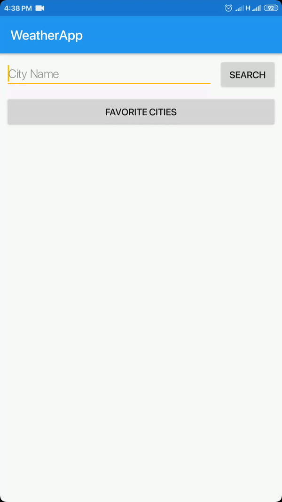

# WeatherApp
an app  that deals with getting weather forecast from OpenWeatherMap RestFull API for chosen city
and make a local list of favorites Cities.
using : gitflow, Clean Architecture , kotlin , Architecture Components (-ViewModel  -LiveData -Room )
, MVP , RxJava and Retrofit

## Demo

[Watch the video](https://youtu.be/h5KGBeInffg)
